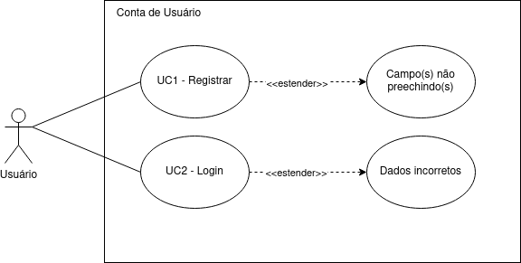
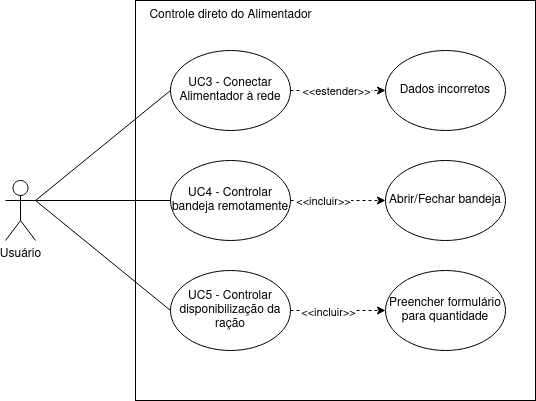
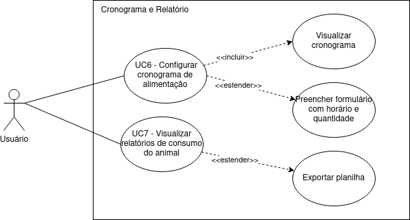

## 1. Introdução

Os casos de uso são uma técnica de descoberta de requisitos, sendo que em sua forma mais simples, um caso de uso identifica os atores envolvidos em uma interação e dá nome ao tipo de interação. Essa é, então, suplementada por informações adicionais que descrevem a interação com o sistema. A informação adicional pode ser uma descrição textual, que foi o método completar que o grupo escolheu, mas pode ser feito através de um ou mais modelos gráficos, como diagrama de sequência ou de estados da UML.

O conjunto de casos de uso representa todas as possíveis interações que serão descritas nos requisitos de sistema. Um diagrama de caso de uso possui os seguintes elementos:

- **Atores:** que podem ser pessoas ou outros sistemas, e são representados como figuras ‘palito’;
- **Classe de interação:** representa as ações dos usuários ou do sistema, e são representadas por uma elipse;
- **Relacionamentos:** fazem a ligação entre os atores e a interação;
- **Caixa de limite do sistema:** define um escopo do sistema para os casos de uso. Todos os casos de uso fora da caixa são considerados fora do escopo do sistema.

## 2. Diagramas de casos de uso

### 2.1 Caso de uso relacionado a conta do usuário

### 2.2 Caso de uso relacionado ao controle do alimentador

### 2.3 Caso de uso relacionado aos relatórios alimentares

## 3. Descrição dos casos de uso

### 3.1 Caso 1: Fazer Cadastro

| Caso 1 | Informações |
| :----: | :----------- |
| Ator(es) | Usuário |
| Requisitos | Ter o aplicativo já instalado em seu dispositivo e ter acesso à internet |
| Pré-condições | Usuário abre a aplicação e não está logado |
| Fluxo | 1 - Usuário seleciona a opção “Registrar-se”   2 - Aplicativo exibe tela de formulário com campos de nome do usuário, email e senha    3 - Usuário informa os dados e seleciona a opção “Enviar”   4 - Aplicativo exibe feedback de sucesso do registro e volta a tela de login   |
| Fluxo Alternativo | 1 - Usuário seleciona a opção “Registrar-se”   2 - Aplicativo exibe a tela de formulário com os campos para  registro    3 - Usuário seleciona a opção voltar e retorna a tela de login   |
| Fluxo de Excessão | Aplicativo ou servidor está offline |
| Pós-condições | Usuário está registrado | 

<figcaption>Tabela 1 - Descrição do Caso de Uso 1</figcaption>

### 3.2 Caso 2: Fazer Login

| Caso 2 | Informações |
| :----: | :----------- |
| Ator(es) | Usuário |
| Requisitos | Ter o aplicativo já instalado em seu dispositivo e ter acesso à internet |
| Pré-condições | Usuário abre a aplicação e não está logado, mas possui uma conta |
| Fluxo | 1 - Usuário informa email e senha e clica em continuar   2 - Aplicativo exibe a tela principal ou para a tela de pareamento caso o alimentador não esteja registrado   |
| Fluxo de Excessão | Aplicativo ou servidor está offline |
| Pós-condições | Usuário está logado | 

<figcaption>Tabela 2 - Descrição do Caso de Uso 2</figcaption>

### 3.3 Caso 3: Conectar alimentador à rede

| Caso 3 | Informações |
| :----: | :----------- |
| Ator(es) | Usuário |
| Requisitos | Smartphone conectado à rede(wifi) do alimentador, servidores ativos |
| Pré-condições | O aplicativo abre a tela para submeter os dados do wi-fi |
| Fluxo | 1 - O usuário informa o SSID e a senha do wi-fi e seleciona a opção "enviar"   2 - O alimentador se conecta ao wi-fi e ao servidor MQTT    3 - O aplicativo exibe uma mensagem de sucesso ao usuário e é redirecionado para a tela principal  |
| Fluxo Alternativo | 1 - O usuário informa o SSID e a senha do wi-fi e toca em enviar   2 - O alimentador falha em se conectar ao wi-fi e envia o erro para o aplicativo    3 - O aplicativo exibe o erro para o usuário e volta à tela de dados de conexão ao wi-fi   |
| Pós-condições | O usuário tem acesso a tela e funcionalidades principais do sistema | 

<figcaption>Tabela 3 - Descrição do Caso de Uso 3</figcaption>

### 3.4 Caso 4: Controlar a bandeja

| Caso 4 | Informações |
| :----: | :----------- |
| Ator(es) | Usuário |
| Requisitos | Alimentador e aplicativo conectados a internet |
| Pré-condições | O usuário está na tela principal do aplicativo |
| Fluxo | 1 - Usuário observa o estado da bandeja na tela e clica no botão de abrir/fechar   2 - Aplicativo manda o comando para o alimentador e exibe o estado do comando    3 - Alimentador abre/fecha a bandeja conforme o comando  |
| Fluxo de Excessão | Alimentador ou aplicativo está offline e não permite a realização do comando |
| Pós-condições | Alimentador está com a bandeja aberta ou fechada conforme o comando dado pelo usuário | 

<figcaption>Tabela 4 - Descrição do Caso de Uso 4</figcaption>

### 3.5 Caso 5: Controlar a quantidade de ração disponibilizada

| Caso 5 | Informações |
| :----: | :----------- |
| Ator(es) | Usuário |
| Requisitos | Alimentador e aplicativo conectados a internet |
| Pré-condições | O usuário seleciona a opção de disponibilizar ração remotamente |
| Fluxo | 1 - Aplicativo exibe tela com formulário para quantidade de ração a ser disponibilizada em gramas   2 - Usuário informa a quantidade de ração e clica em “disponibilizar”    3 - Aplicativo exibe estado do alimentador enquanto este realiza o processo   |
| Fluxo Alternativo | 1 - Aplicativo exibe tela com formulário para quantidade de ração a ser disponibilizada em gramas   2 - Usuário clica em “cancelar” e aplicativo volta à tela principal   |
| Fluxo de Excessão | Alimentador ou aplicativo está offline e não permite a realização do comando |
| Pós-condições | Alimentador fornece a quantidade de ração informada e abre a bandeja | 

<figcaption>Tabela 5 - Descrição do Caso de Uso 5</figcaption>

### 3.6 Caso 6: Configurar horários para a alimentação

| Caso 6 | Informações |
| :----: | :----------- |
| Ator(es) | Usuário |
| Requisitos | Alimentador e aplicativo conectados a internet |
| Pré-condições | O usuário navegar até a aba de cronograma |
| Fluxo | 1 - Usuário seleciona a opção “agendar”   2 - Aplicativo exibe formulário   3 - Usuário informa os dados e clica em “agendar”   4 - Aplicativo exibe feedback do envio do agendamento e os dados deste aparecem na tela do cronograma   |
| Fluxo de Excessão | Alimentador ou aplicativo está offline e não permite a realização do comando |
| Pós-condições | Cronograma de alimentação do pet atualizado | 

<figcaption>Tabela 6 - Descrição do Caso de Uso 6</figcaption>

### 3.7 Caso 7:  Visualizar/Exportar relatório de alimentação do pet

| Caso 7 | Informações |
| :----: | :----------- |
| Ator(es) | Usuário |
| Requisitos | Alimentador e aplicativo conectados a internet |
| Pré-condições | O usuário abre o aplicativo e navega até a aba “Relatório” |
| Fluxo | 1 - Aplicativo exibe tela com gráficos do consumo do pet ao longo do tempo   2 - Usuário seleciona os filtros para o período que ele quer visualizar   |
| Fluxo Alternativo | 1 - Aplicativo exibe tela com gráficos do consumo do pet ao longo do tempo   2 - Usuário seleciona os filtros para o período que ele quer visualizar e clica no botão “exportar”    3 - Aplicativo gera uma planilha e salva no dispositivo do usuário   |
| Fluxo de Excessão | Alimentador ou aplicativo está offline |
| Pós-condições | Usuário visualiza os dados de consumo do pet | 

<figcaption>Tabela 7 - Descrição do Caso de Uso 7</figcaption>

## Referências e Bibliografias
> SOMMERVILLE, Ian. Engenharia de Software. 9.ed. São Paulo: Pearson Prentice Hall, 2011. 529 p.

## Versionamento
| Versão | Data | Modificação | Autor |
|--|--|--|--|
| 1.0 | 11/05/2023 | Identificação dos casos de uso | João Victor e Wagner |
| 1.1 | 12/05/2023 | Adição dos diagramas e correções no texto | João Victor e Wagner