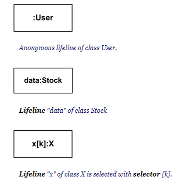
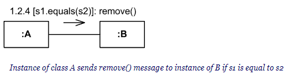
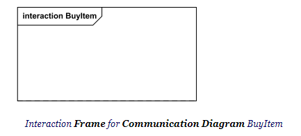
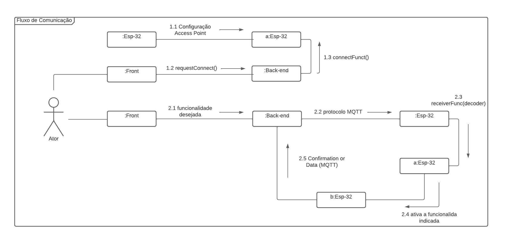

# Introdução 
O diagrama de comunicação, também chamado de diagrama de colaboração, é uma representação dinâmica que ilustra a interação entre objetos ou partes de um aplicativo ou sistema de software. Utilizando mensagens e setas sequenciais, ele demonstra como esses elementos se comunicam.

Esses diagramas são fundamentais para determinar as responsabilidades de classe e interface, pois fornecem informações valiosas e servem como inspiração. Seu objetivo principal é esclarecer a estrutura das mensagens trocadas entre os objetos durante as interações, além de demonstrar os relacionamentos existentes.

# Metodologia 
 E para a elaboração dos diagramas é preciso conhecer os três conceitos: Lifeline, Message, e Frame. 

### Lifeline 
A Lifeline é o elemento que retrata uma entidade na interação através da especificação do nome, e cada lifeline deve representar apenas uma entidade.   

### Message 
A Message é uma linha que interliga duas Lifelines, e possui uma seta, acima da linha, para indicar a direção da comunicação. 

### Frame 
O Frame é uma moldura usada para nomear e delimitar o diagrama, sendo que, o nome precisa estar na parte superior direita. 

<figcaption>Figura 1: exemplo de um Lifeline</figcaption>

<figcaption>Figura 2: exemplo de um Message</figcaption>

<figcaption>Figura 3: exemplo de um Frame</figcaption>

# Diagrama

<figcaption>Figura 4: Diagrama de comunicação</figcaption>

# Bibliografia   

> - Fakhroutdinov, Kirill. UML Communication Diagrams Overview. UML Diagrams. Disponível em: <https://www.uml-diagrams.org/communication-diagrams.html/>. Acesso em: 12 de Maio de 2023.

# Versionamento 

Versão | Data | Modificação | Autor(es) | 
|--|--|--|--| 
|1.0|12/05/2023|Criação do documentação|João Victor, Ítalo e Guilherme| 
|1.1|16/05/2023|Criação do diagrama|João Victor, Ítalo e Guilherme| 